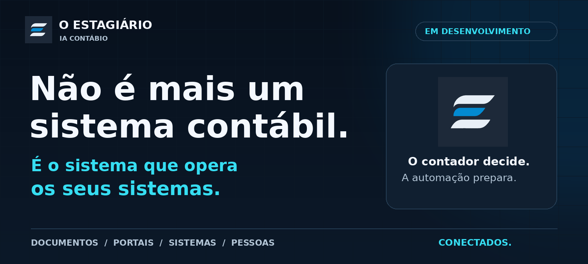
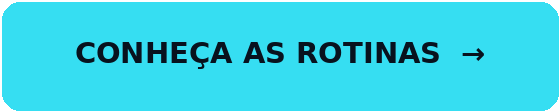
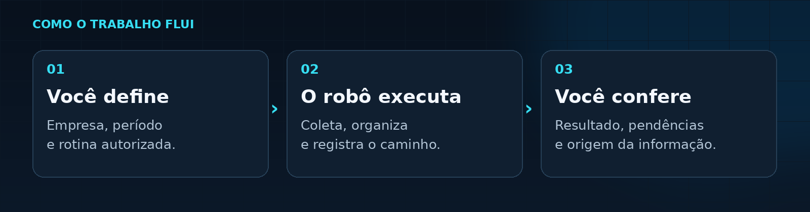
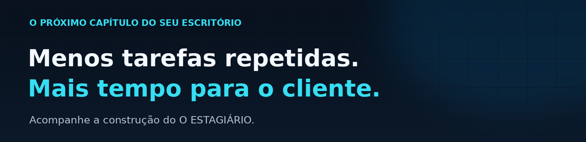

  <picture>
    <source media="(max-width: 600px)" srcset="./assets/showcase/hero-mobile.png">
    
  </picture>

<strong>Buscar documentos. Organizar informações. Preparar conferências. Automatizar o trabalho entre os sistemas que seu escritório já usa.</strong>

O ESTAGIÁRIO combina inteligência artificial, robôs e integrações para tirar a repetição do centro da rotina contábil. <strong>Não é uma proposta de troca de ERP. É uma camada de execução para trabalhar com ele.</strong>

  
  

<a href="#user-content-proposta">A proposta</a> · <a href="#user-content-fluxo">Como funciona</a> · <a href="#user-content-integracoes">Integrações</a> · <a href="#user-content-tecnica">Visão técnica</a> · <a href="#user-content-duvidas">Perguntas frequentes</a> · <a href="#user-content-apoie">Apoie com uma estrela</a>

Desenvolvimento ativo · Pilotos controlados · Disponibilidade por rotina homologada

<h2>Seu escritório não precisa de mais cliques. Precisa de mais trabalho resolvido.</h2>

Todo dia, alguém busca uma nota, confere um cadastro, verifica um certificado e leva um arquivo de um sistema para outro. A informação já existe. <strong>O que falta é conectar o trabalho.</strong>

É nesse espaço que O ESTAGIÁRIO atua: preparar a parte operacional para que a equipe concentre atenção nas exceções, na análise e no cliente.

<table width="100%">
  <tr>
    <td width="50%" valign="top">
      
MENOS TEMPO NO REPETITIVO

      <h3>De sistema em sistema.</h3>
      
Buscar arquivo por arquivo. Repetir informações já cadastradas. Descobrir um bloqueio só no fim. Refazer uma rotina sem saber onde parou.

    </td>
    <td width="50%" valign="top">
      
MAIS FOCO NO QUE EXIGE VOCÊ

      <h3>Da informação à decisão.</h3>
      
Conferir documentos organizados. Tratar pendências identificadas. Consultar o histórico da execução. Orientar o cliente com mais contexto.

    </td>
  </tr>
</table>

<blockquote>
<strong>Seu contador não precisa ser substituído. O trabalho repetitivo dele é que precisa ser repensado.</strong>
</blockquote>

<h2>O que ele faz, na prática.</h2>

Estas são as frentes do produto. Há componentes exercitados e integrações em evolução; <a href="#user-content-integracoes">veja o estágio de cada frente</a>.

<table width="100%">
  <tr>
    <td width="64" align="center" valign="top"> </td>
    <td>
      
01 / COLETA FISCAL <strong>Notas no lugar certo.</strong>

      
Recursos de <strong>NF-e/DF-e e NFS-e</strong> para reunir documentos de fontes autorizadas e organizá-los por empresa, competência e direção.

      
<strong>Para a equipe:</strong> Menos procura dispersa. Mais material para conferir.

    </td>
  </tr>
  <tr>
    <td width="64" align="center" valign="top"> </td>
    <td>
      
02 / CADASTRO <strong>Menos redigitação.</strong>

      
Uma fonte online aprovada como ponto de partida. A automação cruza <strong>identidade, cadastro, certificado e destinos</strong>; conflitos viram pendências.

      
<strong>Para a equipe:</strong> Reaproveitar informação em vez de cadastrá-la outra vez.

    </td>
  </tr>
  <tr>
    <td width="64" align="center" valign="top"> </td>
    <td>
      
03 / CERTIFICADOS <strong>Atenção antes do bloqueio.</strong>

      
O painel destaca <strong>certificados próximos do vencimento e já vencidos</strong>, junto das empresas que precisam de atenção.

      
<strong>Para a equipe:</strong> Antecipar a renovação e entender por que uma rotina parou.

    </td>
  </tr>
  <tr>
    <td width="64" align="center" valign="top"> </td>
    <td>
      
04 / CONFERÊNCIA <strong>Números com origem.</strong>

      
<strong>Resumos e relatórios</strong> com valores observados, retenções, cancelamentos e origem da informação, conforme o documento e o fluxo.

      
<strong>Para a equipe:</strong> Conferir o resultado e saber de onde ele veio.

    </td>
  </tr>
  <tr>
    <td width="64" align="center" valign="top"> </td>
    <td>
      
05 / WEB + WINDOWS <strong>Seus sistemas continuam.</strong>

      
<strong>APIs e importações oficiais primeiro.</strong> Quando esses canais não bastam, robôs executam procedimentos autorizados nas telas.

      
<strong>Para a equipe:</strong> Conectar etapas sem reinventar o sistema contábil.

    </td>
  </tr>
  <tr>
    <td width="64" align="center" valign="top"> </td>
    <td>
      
06 / EM DESENVOLVIMENTO <strong>Prévia para revisar.</strong>

      
A frente Sittax busca obter a <strong>prévia do Simples Nacional</strong> para empresa e competência autorizadas, com confirmação do resultado.

      
<strong>Limite atual:</strong> Não anunciada como pronta. Transmissão e envio ao cliente ficam fora da prévia.

    </td>
  </tr>
</table>

<h2>Uma rotina autorizada. Um caminho verificável.</h2>

O objetivo é simples: <strong>você define o escopo, o robô executa o procedimento e a equipe confere o resultado.</strong> A IA ajuda a interpretar; não recebe uma autorização irrestrita para agir.

  <picture>
    <source media="(max-width: 600px)" srcset="./assets/showcase/fluxo-mobile.png">
    
  </picture>

<strong>Automação também é saber parar.</strong> Empresa errada, competência divergente ou resultado incerto não devem virar outro clique às cegas. Identidade, estado da execução e evidências fazem parte do desenho do produto.

<h2>A marca ganha vida.</h2>

Conheça a identidade visual do O ESTAGIÁRIO na <strong>animação original de abertura do aplicativo</strong>.

  <a href="./assets/estagiario-splash.mp4">
    <picture>
      <source media="(prefers-reduced-motion: reduce)" srcset="./assets/showcase/animation-poster.png">
      
    </picture>
  </a>

<a href="./assets/estagiario-splash.mp4"><strong>▶ Abrir o vídeo original</strong></a> Animação de marca. Não é uma demonstração completa das funcionalidades.

<h2>Construído para o mundo real. Validado uma rotina por vez.</h2>

Não prometemos operar qualquer sistema com um único clique. Cada integração precisa de acesso autorizado, procedimento conhecido e validação própria.

<table width="100%">
  <tr><th align="left">Frente</th><th align="left">Estágio apresentado</th></tr>
  <tr><td><strong>Documentos, cadastros e conferência</strong></td><td>Componentes e pilotos documentados; cobertura varia por fonte, acesso e operação.</td></tr>
  <tr><td><strong>Domínio</strong></td><td>Integração progressiva, com homologação por processo.</td></tr>
  <tr><td><strong>Sittax / Simples Nacional</strong></td><td>Automação da prévia em desenvolvimento. Não anunciada como operação completa em produção.</td></tr>
  <tr><td><strong>SAAM e novas rotinas</strong></td><td>Expansão planejada, condicionada à descoberta e à validação.</td></tr>
</table>

<a href="./ROADMAP.md"><strong>Veja a direção do produto no roadmap público →</strong></a>

<h2>Para quem quer olhar além da apresentação.</h2>

<strong>Arquitetura, decisões e resultados com contexto.</strong> A área técnica explica como o projeto separa IA e execução, trata falhas, confere documentos e delimita cada integração — sem distribuir o código proprietário.

<table width="100%">
  <tr><th align="left">Entenda a engenharia</th><th align="left">Avalie a evidência</th></tr>
  <tr><td><a href="./docs/tecnica/ARQUITETURA.md">Arquitetura e responsabilidades</a> <a href="./docs/tecnica/CONFIABILIDADE.md">Retomada sem repetição cega</a> <a href="./docs/tecnica/DADOS-E-PRIVACIDADE.md">Dados com origem e privacidade</a></td><td><a href="./docs/tecnica/EVIDENCIAS.md">Caderno de evidências E01–E05</a> <a href="./docs/tecnica/INTEGRACOES.md">Estágio real de cada integração</a> <a href="./docs/tecnica/AVALIACAO.md">Como avaliar um piloto</a></td></tr>
</table>

<strong>Entre os registros revisados:</strong> 35 testes da fundação sintética Sittax; três canários reais de coleta SEFAZ GO documentados; análise local de 5.000 XMLs sintéticos; e uma rodada real com confirmação de novos documentos no destino. Cada resultado tem data, escopo e limites no <a href="./docs/tecnica/EVIDENCIAS.md">caderno de evidências</a> — não são métricas ao vivo nem uma homologação global do produto.

<a href="./docs/tecnica/README.md"><strong>Explorar a visão técnica completa →</strong></a>

<h2>Nasceu dentro da rotina. Não de uma apresentação de slides.</h2>

Durante seu estágio em Ciências Econômicas na <strong>Prótons Consultoria, em Goiânia</strong>, Thiago Caetano Faria encontrou um problema concreto: profissionais preparados para analisar empresas gastavam parte do dia movimentando informações entre sistemas.

O ESTAGIÁRIO nasceu da ideia de um apoio digital para <strong>preparar o trabalho, registrar o que fez e levar ao contador o que precisa de atenção</strong>. A tecnologia entra para ampliar a capacidade da equipe — não para tomar seu julgamento profissional.

<a href="https://github.com/thiagocfaria"><strong>Conheça Thiago Caetano Faria, criador do projeto →</strong></a>

<h2>Antes de você perguntar.</h2>

  
<strong>Preciso trocar meu sistema contábil?</strong>

  
Essa não é a proposta. O ESTAGIÁRIO é desenvolvido para trabalhar com o ecossistema existente. Isso não significa compatibilidade automática com todos os sistemas: cada rotina precisa ser integrada e homologada.

  
<strong>É só um chat que responde perguntas?</strong>

  
Não é essa a proposta. A experiência combina conversa, robôs e integrações. A IA ajuda a interpretar informações; a execução repetitiva fica em procedimentos autorizados e verificáveis.

  
<strong>Já posso usar todas essas rotinas em produção?</strong>

  
Não. O produto está em desenvolvimento ativo, com pilotos e componentes exercitados. Demonstração, código existente e testes de laboratório não significam disponibilidade geral. A liberação é feita por fluxo homologado.

  
<strong>Meus dados ficam sempre no computador do escritório?</strong>

  
Depende da implantação e dos provedores configurados. Existem operações locais, mas a camada de IA pode utilizar serviços externos. Um ambiente inteiramente local exige configuração e verificação próprias; esta apresentação não é uma declaração de conformidade integral com a LGPD.

  
<strong>A prévia substitui o fechamento ou transmite obrigações?</strong>

  
Não. Relatórios e prévias apoiam a conferência. Não substituem automaticamente a escrituração, o PGDAS-D, a transmissão de obrigações ou a revisão do profissional responsável. A frente atual de prévia do Sittax não inclui transmissão.

  
<strong>Por que o repositório é público, mas o código não está aqui?</strong>

  
Este é o espaço público de apresentação e acompanhamento. O código-fonte do produto é proprietário e continua privado. Aqui ficam a identidade visual, a documentação técnica de alto nível, os resumos de evidências e o roadmap — não credenciais, certificados, código interno ou dados de clientes.

 

  <picture>
    <source media="(max-width: 600px)" srcset="./assets/showcase/convite-mobile.png">
    
  </picture>

<h2 align="center">Esse problema também existe no seu escritório?</h2>

<strong>Deixe uma ⭐ no topo do repositório e acompanhe a evolução.</strong> Sua estrela ajuda outras pessoas a encontrar o projeto.

<a href="https://github.com/thiagocfaria/O-ESTAGIARIO-PUBLIC/issues/new?title=Sugest%C3%A3o%20de%20rotina"><strong>Conte qual rotina você automatizaria →</strong></a> · <a href="./ROADMAP.md"><strong>Veja o roadmap →</strong></a>

Nas sugestões, não inclua credenciais, documentos fiscais ou dados identificáveis de clientes.

<a href="./CONTRIBUTING.md">Como contribuir</a> · <a href="./SECURITY.md">Relato privado de segurança</a> · <a href="./docs/tecnica/README.md">Documentação técnica</a>

<strong>O ESTAGIÁRIO · IA CONTÁBIO</strong> Goiânia, Goiás · Código proprietário · Desenvolvimento e homologação progressivos Marcas de terceiros pertencem aos seus titulares. Menção não implica afiliação.

