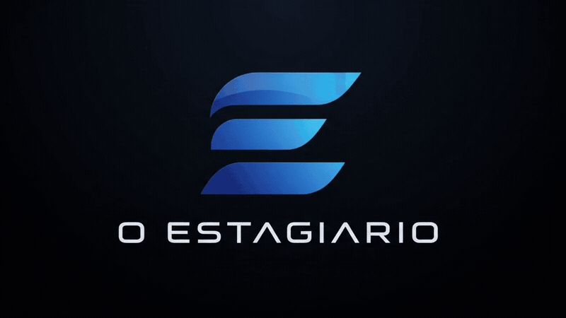

  <strong>O ESTAGIÁRIO</strong> 
  IA CONTÁBIO · AUTOMAÇÃO PARA ESCRITÓRIOS CONTÁBEIS

  <a href="./assets/estagiario-splash.mp4">
    <picture>
      <source media="(prefers-reduced-motion: reduce)" srcset="./assets/estagiario-splash-dark.png">
      
    </picture>
  </a>

<h1 align="center">Não é mais um sistema contábil.</h1>
<h3 align="center">É o sistema que opera os seus sistemas.</h3>

Inteligência artificial e robôs para conectar tarefas, operar fluxos autorizados e transformar documentos em informação útil. Sua equipe mantém o controle. O trabalho repetitivo deixa de ocupar o centro do dia.

  
  
  

<a href="#user-content-por-que">A proposta</a> · <a href="#user-content-capacidades">O que faz</a> · <a href="#user-content-integracoes">Integrações</a> · <a href="#user-content-historia">Nossa história</a>

A animação acima vem da abertura original do aplicativo. <a href="./assets/estagiario-splash.mp4">Ver o vídeo com áudio.</a>

<h2>Seu escritório precisa de mais capacidade. Não de mais tarefas manuais.</h2>

Buscar notas. Repetir cadastros. Conferir arquivos. Acompanhar certificados. Abrir um sistema para levar informação a outro. Quando essas tarefas dominam a rotina, sobra pouco tempo para analisar o negócio do cliente.

<strong>O ESTAGIÁRIO nasce para mudar essa relação.</strong> Em vez de obrigar o escritório a trocar todo o ambiente contábil, a plataforma combina IA, robôs e integrações para trabalhar com as ferramentas que já fazem parte da operação.

<blockquote>
  
<strong>Menos tempo movimentando informação. Mais tempo transformando informação em orientação para o cliente.</strong>

</blockquote>

<h2>Da coleta à conferência.</h2>

<h3>01 · Cadastro sem redigitação.</h3>

A automação cruza identidade da empresa, cadastro, certificado e destinos já conhecidos para reduzir repetição manual. Quando falta informação ou existe conflito, o fluxo deve parar e sinalizar a pendência em vez de adivinhar.

<h3>02 · Documentos reunidos e organizados.</h3>

O projeto reúne rotinas para trabalhar com <strong>NF-e, NFC-e, NFS-e e outros documentos fiscais</strong>, organizando o que foi coletado por empresa, competência e finalidade.

<h3>03 · Certificados sob controle.</h3>

O painel pode destacar certificados próximos do vencimento, expirados ou ausentes e relacionar isso às empresas que precisam de atenção antes que a rotina seja bloqueada.

<h3>04 · Informação pronta para conferir.</h3>

Documentos e rotinas alimentam <strong>resumos, evidências e relatórios de conferência</strong>. A meta não é produzir uma caixa-preta: é conseguir responder de onde veio o número, qual etapa executou e o que ainda depende de revisão.

<h3>05 · Robôs que operam o ecossistema existente.</h3>

Quando não existe API ou importação oficial suficiente, o projeto usa automação web e desktop para executar procedimentos aprovados em portais e sistemas já utilizados pelo escritório.

<blockquote>
  
<strong>A IA ajuda a interpretar. Os robôs executam as rotinas autorizadas. O contador mantém o julgamento profissional.</strong>

</blockquote>

<h2>Não substitui seus sistemas. Conecta o trabalho entre eles.</h2>

A proposta não é colocar mais uma tela entre o contador e o serviço. É construir uma camada de execução capaz de trabalhar com <strong>portais, APIs, arquivos e aplicações Windows</strong>, reduzindo a passagem manual de uma etapa para a seguinte.

<table>
  <tr><th align="left">Frente</th><th align="left">Direção</th></tr>
  <tr><td><strong>Coleta fiscal</strong></td><td>Buscar, validar e organizar documentos por empresa e competência.</td></tr>
  <tr><td><strong>Sistemas contábeis</strong></td><td>Integrar rotinas homologadas sem reinventar o ERP.</td></tr>
  <tr><td><strong>Sittax / Simples Nacional</strong></td><td>Prévia assistida em desenvolvimento, separada de qualquer transmissão automática.</td></tr>
  <tr><td><strong>Windows e web</strong></td><td>Automação determinística quando um canal oficial melhor não estiver disponível.</td></tr>
</table>
<h2>Uma automação que sabe parar.</h2>

Automatizar não é apenas clicar rápido. Em rotinas contábeis, a capacidade de <strong>validar identidade, registrar estado, retomar uma execução e não duplicar um efeito incerto</strong> é parte do produto.

Por isso, o projeto evolui com princípios simples:

<ul>
  <li>empresa e competência precisam ser confirmadas antes de qualquer efeito;</li>
  <li>ações sensíveis exigem autorização explícita;</li>
  <li>uma queda não deve virar um segundo clique às cegas;</li>
  <li>logs e evidências existem para explicar a execução, não para esconder o problema;</li>
  <li>APIs e importações oficiais têm preferência sobre automação de tela.</li>
</ul>

<h2>Mais contexto para responder. Mais tempo para orientar.</h2>

A experiência conversacional aproxima a IA dos relatórios e arquivos autorizados do escritório. Em vez de respostas genéricas, o objetivo é ajudar o contador a localizar informação, compreender uma pendência e chegar às evidências.

<blockquote>
  
“Quais empresas precisam de atenção hoje?” 
  “O que mudou desde a última conferência?” 
  “De onde veio este valor?”

</blockquote>

<strong>Privacidade, nuvem e limites</strong>

O ESTAGIÁRIO é um projeto em desenvolvimento e não deve ser confundido com uma certificação fiscal, jurídica ou de conformidade. A arquitetura busca minimizar dados enviados a serviços externos e reservar operações sensíveis para fluxos autorizados. A configuração de cada implantação determina o que permanece local e o que utiliza provedores externos.

Relatórios e prévias apoiam a conferência profissional; não substituem automaticamente escrituração, declarações oficiais, transmissão de obrigações ou revisão do contador responsável.

<h2>Nasceu de um problema real. E de uma pergunta simples.</h2>

O ESTAGIÁRIO começou dentro da rotina de um escritório contábil em Goiânia. O problema era visível: profissionais preparados para analisar empresas gastavam parte do dia procurando documentos, repetindo cadastros e transportando informação entre sistemas.

<blockquote>
  
<strong>E se o escritório tivesse um estagiário digital para preparar o trabalho, registrar o que fez e levar ao contador somente o que realmente precisa de atenção?</strong>

</blockquote>

Dessa pergunta surgiu o projeto: uma proposta de IA contábil que combina automação, cálculos verificáveis e acompanhamento operacional. Não para substituir o contador, mas para ampliar a capacidade de atender bem e entregar informação útil ao cliente.

<strong>Thiago Caetano Faria</strong> Desenvolvedor do O ESTAGIÁRIO, com foco em inteligência artificial aplicada e automação de processos contábeis.

<strong>O que este repositório público contém?</strong>

Esta é a <strong>vitrine pública</strong> do O ESTAGIÁRIO. Ela contém apresentação, identidade visual, animação oficial e roadmap público. O código-fonte do produto permanece proprietário e não é distribuído por este repositório.

Também não são publicados aqui credenciais, certificados, configurações internas, dados de clientes ou artefatos fiscais.

<strong>Qual é o estágio atual?</strong>

O projeto está em desenvolvimento ativo, com componentes testados em laboratório e fluxos reais controlados. Cada integração é promovida gradualmente conforme o procedimento é observado, automatizado, testado e homologado. Presença de código ou demonstração não significa disponibilidade geral em produção.

<h2 align="center">Seu escritório já tem os sistemas. O próximo passo é fazer a rotina fluir.</h2>

  

<strong>O ESTAGIÁRIO</strong> Menos operação repetitiva. Mais capacidade para cuidar do cliente.

  <a href="./ROADMAP.md"><strong>Ver roadmap</strong></a>
  ·
  <a href="./assets/estagiario-splash.mp4"><strong>Assistir ao vídeo</strong></a>
  ·
  <a href="https://github.com/thiagocfaria"><strong>Conhecer o desenvolvedor</strong></a>

<strong>⭐ Se esse problema também existe no seu escritório, deixe uma estrela e acompanhe a evolução.</strong>

Vitrine pública · código proprietário · Goiânia, Goiás · desenvolvimento e homologação progressivos

