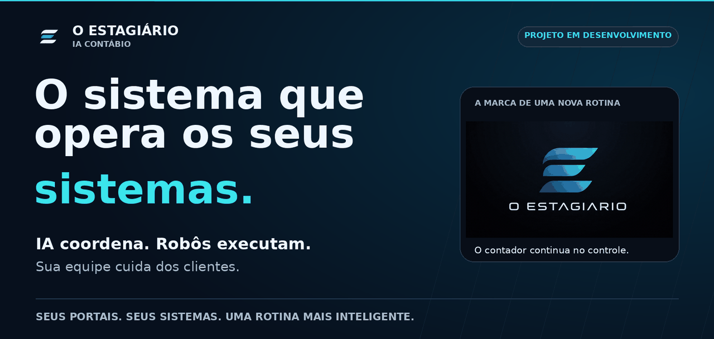
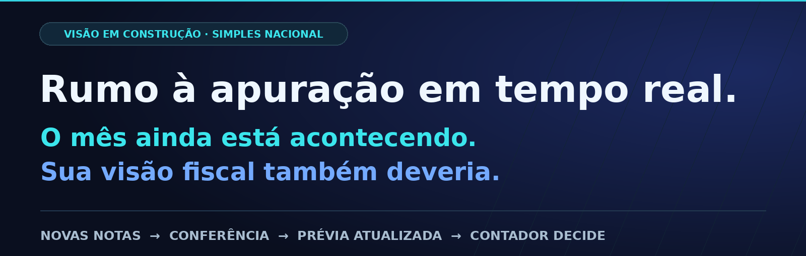
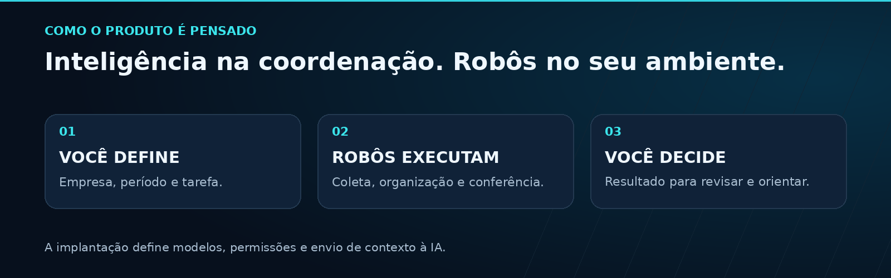
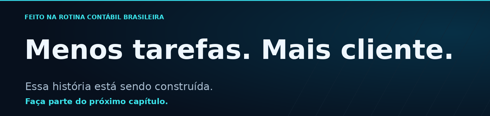

  <a href="./assets/estagiario-splash.mp4">
    <picture>
      <source media="(max-width: 600px) and (prefers-reduced-motion: reduce)" srcset="./assets/product/hero-mobile.png">
      <source media="(prefers-reduced-motion: reduce)" srcset="./assets/product/hero-desktop.png">
      <source media="(max-width: 600px)" srcset="./assets/product/hero-mobile.gif">
      
    </picture>
  </a>

<h1 align="center">Menos operação. Mais contabilidade.</h1>

O ESTAGIÁRIO une <strong>inteligência artificial e robôs</strong> para trabalhar nos sistemas que o seu escritório já usa: buscar notas, organizar documentos, preparar conferências e construir uma visão fiscal mais próxima do dia a dia do cliente.

<strong>Não é mais um ERP para alimentar. É um estagiário digital para fazer a rotina acontecer.</strong>

  
  

<a href="#user-content-integracoes">Seus sistemas</a> · <a href="#user-content-visao">Apuração contínua</a> · <a href="#user-content-atendimento">Atendimento</a> · <a href="#user-content-privacidade">Seus dados</a> · <a href="./docs/tecnica/README.md">Visão técnica</a>

Desenvolvimento ativo, com pilotos reais e integrações em evolução. <a href="#user-content-integracoes">Veja o estágio de cada frente.</a>

<h2>O escritório já tem os sistemas. Falta alguém conectar o trabalho.</h2>

A nota está em um portal. O cadastro, em outro lugar. A informação precisa chegar ao sistema contábil. E o cliente quer entender o que mudou. <strong>O ESTAGIÁRIO está sendo construído para conectar essas etapas — não para criar mais uma tarefa para a equipe.</strong>

<table width="100%">
  <tr>
    <td width="56" align="center" valign="top"> </td>
    <td><h3>Da busca de notas ao material organizado.</h3>
Coleta de documentos nas fontes integradas, como <strong>Portal Nacional de NFS-e e SEFAZ GO</strong>, com organização por empresa e período. Menos procura arquivo por arquivo; mais material para conferir. A cobertura depende da fonte e do acesso autorizado.
</td>
  </tr>
  <tr>
    <td width="56" align="center" valign="top"> </td>
    <td><h3>Menos redigitação. Menos surpresa no caminho.</h3>
Reaproveitamento das informações da empresa e conferência de cadastro, certificado e destino dos documentos. <strong>Pendências aparecem para serem resolvidas</strong>, em vez de virar uma importação feita no cliente errado.
</td>
  </tr>
  <tr>
    <td width="56" align="center" valign="top"> </td>
    <td><h3>Números para entender, não só para copiar.</h3>
Resumos com movimentação, retenções e origem dos valores encontrados nos documentos. <strong>A equipe confere a informação e ganha contexto para orientar o cliente.</strong> Um resumo documental não substitui a apuração oficial.
</td>
  </tr>
</table>

<h2>Domínio. Sittax. Portal Nacional. A rotina acontece onde você já trabalha.</h2>

Não é preciso imaginar um escritório começando do zero. A proposta é trabalhar com seus portais, arquivos e sistemas, <strong>automatizando os procedimentos já conhecidos pela equipe</strong>. Usamos integrações oficiais quando disponíveis e robôs nas telas quando necessário.

<table width="100%">
  <tr><th align="left">Onde</th><th align="left">O trabalho e o estágio</th></tr>
  <tr><td><strong>Portal Nacional de NFS-e</strong></td><td>Coleta de notas de serviços, com fluxos reais exercitados.</td></tr>
  <tr><td><strong>SEFAZ GO</strong></td><td>Robô de coleta de entradas e saídas exercitado; conexão ao fluxo completo em evolução.</td></tr>
  <tr><td><strong>Domínio</strong></td><td>Integração em evolução para reduzir o trabalho entre documentos, cadastros e sistema contábil.</td></tr>
  <tr><td><strong>Sittax</strong></td><td>Automação em desenvolvimento para importar documentos e obter a prévia do Simples Nacional.</td></tr>
</table>

Disponibilidade por rotina validada, não por simples menção ao sistema. <a href="./docs/tecnica/INTEGRACOES.md">Confira os detalhes de cada integração.</a>

  <picture>
    <source media="(max-width: 600px)" srcset="./assets/product/visao-mobile.png">
    
  </picture>

<h2>A contabilidade pode acompanhar o negócio. Não apenas esperar o fechamento.</h2>

<strong>É essa história que queremos ajudar a construir no Brasil:</strong> transformar novas notas em uma visão fiscal mais atual, para que o escritório converse com o cliente durante o mês — e não apenas quando o imposto já precisa ser pago.

Nosso primeiro passo é a <strong>prévia contínua do Simples Nacional</strong>: reunir documentos, conferir as informações e atualizar a prévia no Sittax conforme os dados estiverem disponíveis. O contador acompanha, interpreta e decide.

<strong>Esta é a direção do produto, ainda em desenvolvimento.</strong> A atualização depende das fontes e da validação de cada rotina. Prévia não é fechamento, transmissão ou garantia de cobertura de todas as notas. <a href="./ROADMAP.md">Acompanhe o caminho até lá.</a>

<h2>Seu cliente pergunta. O escritório precisa ter de onde responder.</h2>

<strong>“O que mudou neste mês?” “Quais documentos ainda faltam?” “De onde veio este valor?”</strong>

Estamos conectando a conversa com IA aos relatórios e às informações autorizadas do escritório. A ideia é localizar o que importa, explicar pendências e <strong>ajudar a preparar respostas para seus clientes com base nos documentos</strong>, em vez de respostas genéricas.

A integração completa desse atendimento está em evolução. A resposta continua sob revisão da equipe; envio automático ao cliente não faz parte da prévia atual.

  <picture>
    <source media="(max-width: 600px)" srcset="./assets/product/operacao-mobile.png">
    
  </picture>

<h2>Robôs no seu servidor. Você no controle do que a IA recebe.</h2>

A arquitetura separa a execução da conversa. <strong>Os robôs e os cálculos podem trabalhar no ambiente do escritório</strong>, sem precisar enviar cada XML a um modelo de linguagem para realizar essas rotinas. A IA ajuda na coordenação e na interpretação; os procedimentos aprovados não precisam de um modelo decidindo cada clique.

<strong>Execução local não significa, sozinha, ausência de envio de dados.</strong> A conversa pode usar IA externa, conforme a configuração. O conteúdo que entra nesse contexto precisa ser definido e verificado na implantação. Um perfil inteiramente local também exige configuração e validação próprias.

A <strong>LGPD</strong> faz parte dos requisitos de implantação: finalidade definida, uso do mínimo necessário, controle de acesso, retenção e segurança. A proposta é automatizar com responsabilidade, não colocar um selo de conformidade em algo que depende também das práticas do escritório.

<a href="./docs/tecnica/DADOS-E-PRIVACIDADE.md"><strong>Entenda o tratamento dos dados →</strong></a>

<h2>Nasceu de um estágio. Cresceu a partir de um problema real.</h2>

Durante seu estágio em Ciências Econômicas na <strong>Prótons Consultoria, em Goiânia</strong>, Thiago Caetano Faria viu profissionais preparados para analisar empresas gastarem parte do dia movimentando informações entre sistemas.

O ESTAGIÁRIO nasceu de uma pergunta: <strong>e se um apoio digital preparasse o trabalho repetitivo, para que o contador pudesse dedicar mais atenção ao cliente?</strong> É tecnologia construída a partir da rotina contábil brasileira.

<a href="https://github.com/thiagocfaria">Conheça o criador do projeto →</a>

  
<strong>Quer conhecer a engenharia por trás do produto?</strong>

  
A documentação técnica reúne arquitetura, integrações, privacidade, resultados de ensaios e critérios para avaliar um piloto. Os números e seus limites ficam lá; aqui, o foco é o que a proposta representa para o escritório.

  
<a href="./docs/tecnica/README.md">Visão técnica</a> · <a href="./docs/tecnica/EVIDENCIAS.md">Evidências</a> · <a href="./docs/tecnica/AVALIACAO.md">Avaliação de um piloto</a>

  
<strong>Já está disponível para qualquer escritório?</strong>

  
O projeto está em desenvolvimento, com pilotos e frentes em diferentes estágios. Disponibilidade e escopo precisam ser combinados por rotina. Não há acesso automático ao produto nem promessa de integração universal.

  
<strong>O repositório público dá acesso ao código ou aos dados?</strong>

  
Não. Esta é a apresentação pública do produto. O código proprietário, as credenciais e os documentos dos clientes permanecem fora daqui. Sugestões públicas devem conter apenas descrições, sem dados identificáveis.

  
<strong>O que significa o compromisso com a LGPD?</strong>

  
Significa tratar proteção de dados como requisito, com responsabilidades e verificações na implantação. Não é certificação nem garantia automática de conformidade. As referências incluem os princípios do art. 6º e as medidas de segurança do art. 46 da <a href="https://www.planalto.gov.br/ccivil_03/_ato2015-2018/2018/lei/l13709.htm">Lei Geral de Proteção de Dados Pessoais</a>.

<a href="./assets/estagiario-splash.mp4">▶ Assistir à animação original do aplicativo</a> A capa utiliza a identidade animada original da marca, não uma demonstração de funcionalidade.

  <picture>
    <source media="(max-width: 600px)" srcset="./assets/product/convite-mobile.png">
    
  </picture>

<h2 align="center">O próximo capítulo também pode ter a sua participação.</h2>

<strong>Deixe uma estrela no repositório para apoiar a ideia.</strong> Conte qual tarefa mais toma tempo da sua equipe e acompanhe a construção do O ESTAGIÁRIO.

<a href="https://github.com/thiagocfaria/O-ESTAGIARIO-PUBLIC/issues/new?title=Sugest%C3%A3o%20de%20rotina"><strong>Sugerir uma rotina →</strong></a> · <a href="./ROADMAP.md"><strong>Acompanhar a evolução →</strong></a>

Não publique dados de clientes, documentos fiscais ou credenciais nas sugestões.

<strong>O ESTAGIÁRIO · IA CONTÁBIO</strong> Criado em Goiânia, Goiás · Código proprietário · Desenvolvimento e validação progressivos Domínio, Sittax e demais marcas citadas pertencem aos seus titulares. Menção não implica parceria ou afiliação.

